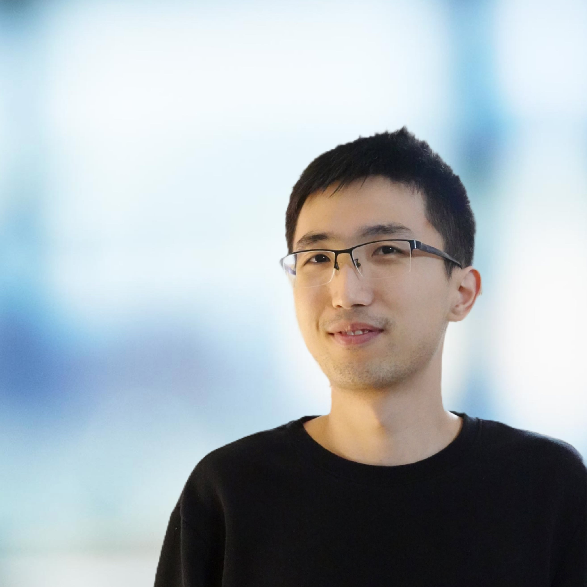

# Sihang Jiang's homepage
I am a PhD student majoring in systems engineering at [University of Virginia](https://engineering.virginia.edu/departments/systems-and-information-engineering), advised by professor [Donald Brown](https://datascience.virginia.edu/people/donald-brown).\
My research interest includes Bayesian machine learning, MCMC, data science techniques in bioinformatics and Bayesian statistics, and my recent projects mainly focus on [Long COVID and COVID related healthcare problems](https://datascience.virginia.edu/news/uva-among-national-leaders-collaborations-publications-covid-19), led by [UVA Ithriv](https://www.ithriv.org/logic-liai) as a part of [N3C research](https://covid.cd2h.org/).

## Education
## Experience
## Publication

